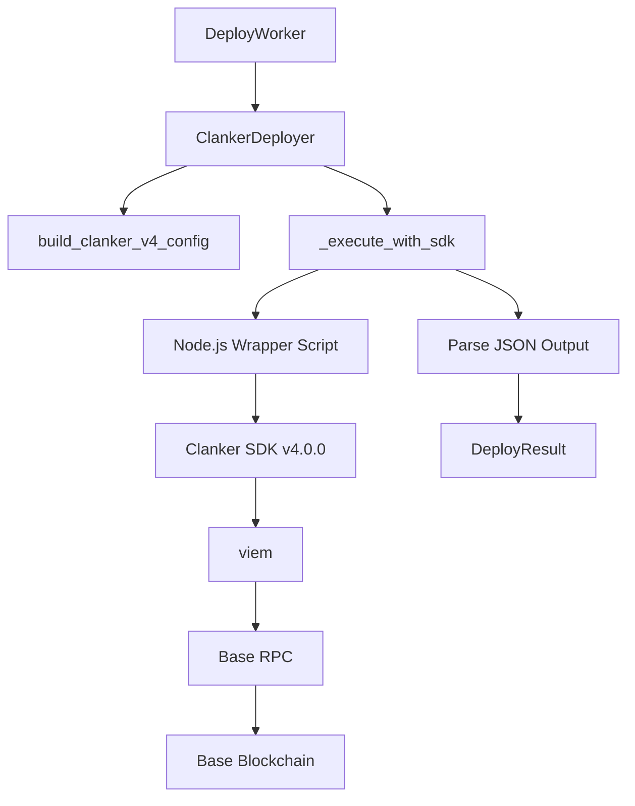
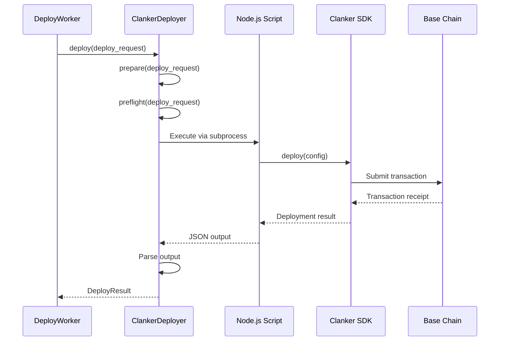
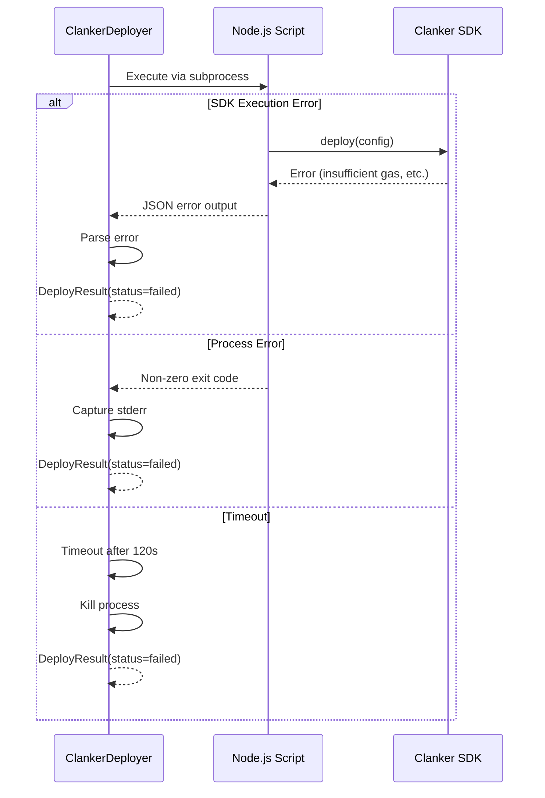

# Design Document: Clanker v4.0.0 SDK Integration

## Overview

This design completes the migration from Clanker v3.1.0 contract-based deployment to v4.0.0 SDK-based deployment. The Clanker v4.0.0 SDK is a TypeScript/Node.js SDK that uses viem for blockchain interactions. The current implementation has the configuration structure in place but uses mock deployments. This design focuses on implementing actual SDK execution via subprocess, parsing deployment results, and updating documentation to reflect the new approach.

The integration will use a Node.js wrapper script approach, allowing the Python application to invoke the TypeScript SDK via subprocess while maintaining clean separation of concerns and error handling.

## Architecture



## Sequence Diagrams

### Main Deployment Flow



### Error Handling Flow



## Components and Interfaces

### Component 1: ClankerDeployer

**Purpose**: Orchestrates token deployment using Clanker SDK v4.0.0

**Interface**:
```python
class ClankerDeployer:
    def __init__(
        self,
        execute: DeployExecutor | None = None,
        rpc_url: str | None = None,
        node_script_path: str | None = None
    ) -> None: ...
    
    async def prepare(self, deploy_request: DeployRequest) -> dict: ...
    async def preflight(self, deploy_request: DeployRequest) -> None: ...
    async def deploy(self, deploy_request: DeployRequest) -> DeployResult: ...
    async def _execute_with_sdk(
        self, deploy_request: DeployRequest, config: dict[str, Any]
    ) -> DeployResult: ...
    def _check_sdk_availability(self) -> bool: ...
```

**Responsibilities**:
- Build v4.0.0 SDK configuration from DeployRequest
- Validate configuration before deployment
- Execute Node.js wrapper script via subprocess
- Parse SDK output (JSON) to extract deployment results
- Handle errors and timeouts
- Return structured DeployResult

### Component 2: Node.js Wrapper Script

**Purpose**: Bridge between Python and TypeScript Clanker SDK

**Interface**:
```typescript
interface DeployConfig {
  name: string;
  symbol: string;
  tokenAdmin: string;
  image: string;
  metadata: object;
  context: object;
  pool: object;
  fees: object;
  rewards: object;
  vault: object | null;
  devBuy: object | null;
}

interface DeployOutput {
  status: "success" | "error";
  txHash?: string;
  contractAddress?: string;
  errorCode?: string;
  errorMessage?: string;
}

async function deploy(config: DeployConfig): Promise<DeployOutput>
```

**Responsibilities**:
- Accept configuration via stdin or command-line argument
- Initialize Clanker SDK with environment variables
- Execute deployment transaction
- Parse SDK response
- Output structured JSON to stdout
- Write errors to stderr
- Exit with appropriate exit codes

### Component 3: Output Parser

**Purpose**: Parse Node.js script output into Python DeployResult

**Interface**:
```python
def parse_sdk_output(stdout: str, stderr: str, exit_code: int) -> DeployResult: ...
```

**Responsibilities**:
- Parse JSON from stdout
- Extract tx_hash and contract_address
- Handle malformed JSON
- Map SDK errors to error codes
- Create DeployResult with appropriate status

## Data Models

### DeployConfig (Node.js)

```typescript
interface DeployConfig {
  name: string;              // Token name
  symbol: string;            // Token symbol
  tokenAdmin: string;        // Admin address (0x...)
  image: string;             // IPFS URI (ipfs://...)
  metadata: {
    description: string;
    socialMediaUrls: string[];
    auditUrls: string[];
  };
  context: {
    interface: string;       // "Clank&Claw"
    platform: string;        // "automated"
    messageId: string;       // candidate_id
    id: string;              // candidate_id
  };
  pool: {
    pairedToken: string;     // WETH address
    positions: string;       // "Standard"
  };
  fees: {
    type: string;            // "static"
    clankerFee: number;      // In bps (1000 = 10%)
    pairedFee: number;       // In bps
  };
  rewards: {
    recipients: Array<{
      recipient: string;     // Fee recipient address
      admin: string;         // Admin address
      bps: number;           // 10000 = 100%
      token: string;         // "Paired" (WETH)
    }>;
  };
  vault: null;               // No vaulting for MVP
  devBuy: null;              // No dev buy for MVP
}
```

**Validation Rules**:
- name: non-empty string, max 50 chars
- symbol: non-empty string, max 10 chars, uppercase
- tokenAdmin: valid EVM address (0x + 40 hex chars)
- image: valid IPFS URI (ipfs://...)
- pairedToken: WETH address on Base (0x4200000000000000000000000000000000000006)
- clankerFee, pairedFee: 0-10000 (0-100%)
- rewards.recipients[0].bps: must equal 10000 (100%)

### DeployOutput (Node.js)

```typescript
interface DeployOutput {
  status: "success" | "error";
  txHash?: string;           // Transaction hash (0x...)
  contractAddress?: string;  // Deployed token address (0x...)
  errorCode?: string;        // Error code (e.g., "insufficient_gas")
  errorMessage?: string;     // Human-readable error message
}
```

**Validation Rules**:
- status: must be "success" or "error"
- If status="success": txHash and contractAddress required
- If status="error": errorCode and errorMessage required
- txHash: 0x + 64 hex chars
- contractAddress: 0x + 40 hex chars

## Algorithmic Pseudocode

### Main Deployment Algorithm

```pascal
ALGORITHM deployWithSDK(deployRequest)
INPUT: deployRequest of type DeployRequest
OUTPUT: result of type DeployResult

BEGIN
  ASSERT deployRequest is valid
  
  // Step 1: Build configuration
  config ← buildClankerV4Config(deployRequest)
  
  // Step 2: Validate configuration
  CALL preflight(deployRequest)
  
  // Step 3: Check SDK availability
  IF NOT sdkAvailable THEN
    RETURN DeployResult(
      status="deploy_failed",
      errorCode="sdk_not_available",
      errorMessage="Node.js or Clanker SDK not installed"
    )
  END IF
  
  // Step 4: Write config to temporary file
  configFile ← createTempFile()
  WRITE JSON.stringify(config) TO configFile
  
  // Step 5: Execute Node.js script
  TRY
    process ← subprocess.create([
      "node",
      nodeScriptPath,
      configFile
    ])
    
    // Set timeout (120 seconds)
    stdout, stderr, exitCode ← process.communicate(timeout=120)
    
    // Step 6: Parse output
    result ← parseSDKOutput(stdout, stderr, exitCode)
    
    RETURN result
    
  CATCH TimeoutError THEN
    process.kill()
    RETURN DeployResult(
      status="deploy_failed",
      errorCode="timeout",
      errorMessage="Deployment timed out after 120 seconds"
    )
    
  CATCH Exception AS exc THEN
    RETURN DeployResult(
      status="deploy_failed",
      errorCode="execution_failed",
      errorMessage=str(exc)
    )
    
  FINALLY
    DELETE configFile
  END TRY
END
```

**Preconditions:**
- deployRequest is validated and well-formed
- Node.js is installed and available in PATH
- Clanker SDK is installed (npm install -g clanker-sdk viem)
- DEPLOYER_SIGNER_PRIVATE_KEY environment variable is set
- BASE_RPC_URL environment variable is set
- Deployer wallet has sufficient ETH for gas

**Postconditions:**
- Returns DeployResult with status "deploy_success" or "deploy_failed"
- If successful: txHash and contractAddress are populated
- If failed: errorCode and errorMessage are populated
- Temporary config file is deleted
- No side effects on input deployRequest

**Loop Invariants:** N/A (no loops in main algorithm)

### Output Parsing Algorithm

```pascal
ALGORITHM parseSDKOutput(stdout, stderr, exitCode)
INPUT: stdout (string), stderr (string), exitCode (integer)
OUTPUT: result of type DeployResult

BEGIN
  // Check exit code first
  IF exitCode ≠ 0 THEN
    // Parse stderr for error message
    errorMessage ← stderr OR "Unknown error"
    
    RETURN DeployResult(
      status="deploy_failed",
      errorCode="sdk_error",
      errorMessage=errorMessage
    )
  END IF
  
  // Parse JSON from stdout
  TRY
    output ← JSON.parse(stdout)
    
    IF output.status = "success" THEN
      ASSERT output.txHash IS NOT NULL
      ASSERT output.contractAddress IS NOT NULL
      
      RETURN DeployResult(
        status="deploy_success",
        txHash=output.txHash,
        contractAddress=output.contractAddress
      )
      
    ELSE IF output.status = "error" THEN
      RETURN DeployResult(
        status="deploy_failed",
        errorCode=output.errorCode OR "unknown_error",
        errorMessage=output.errorMessage OR "Unknown error"
      )
      
    ELSE
      RETURN DeployResult(
        status="deploy_failed",
        errorCode="invalid_output",
        errorMessage="Invalid status in SDK output"
      )
    END IF
    
  CATCH JSONDecodeError THEN
    RETURN DeployResult(
      status="deploy_failed",
      errorCode="parse_error",
      errorMessage="Failed to parse SDK output as JSON"
    )
  END TRY
END
```

**Preconditions:**
- stdout, stderr are strings (may be empty)
- exitCode is integer

**Postconditions:**
- Returns valid DeployResult
- Never raises exceptions (all errors caught and converted to DeployResult)
- If JSON parsing fails, returns deploy_failed with parse_error code

**Loop Invariants:** N/A (no loops)

### SDK Availability Check Algorithm

```pascal
ALGORITHM checkSDKAvailability()
INPUT: None
OUTPUT: available of type boolean

BEGIN
  // Check Node.js
  TRY
    process ← subprocess.run(["node", "--version"])
    IF process.exitCode ≠ 0 THEN
      RETURN false
    END IF
  CATCH Exception THEN
    RETURN false
  END TRY
  
  // Check Clanker SDK (optional - can be installed on-demand)
  TRY
    process ← subprocess.run(["npm", "list", "-g", "clanker-sdk"])
    IF process.exitCode ≠ 0 THEN
      LOG "Clanker SDK not installed globally"
      // Still return true - can use npx
    END IF
  CATCH Exception THEN
    LOG "npm not available"
  END TRY
  
  RETURN true
END
```

**Preconditions:** None

**Postconditions:**
- Returns true if Node.js is available
- Returns false if Node.js is not available
- Logs warnings if npm or clanker-sdk not found
- No side effects

**Loop Invariants:** N/A (no loops)

## Key Functions with Formal Specifications

### Function 1: _execute_with_sdk()

```python
async def _execute_with_sdk(
    self, deploy_request: DeployRequest, config: dict[str, Any]
) -> DeployResult
```

**Preconditions:**
- deploy_request is validated (passed preflight)
- config is valid v4.0.0 SDK configuration
- self._sdk_available is True
- Node.js script exists at self.node_script_path
- DEPLOYER_SIGNER_PRIVATE_KEY environment variable is set

**Postconditions:**
- Returns DeployResult with status "deploy_success" or "deploy_failed"
- If successful: result.tx_hash and result.contract_address are non-null
- If failed: result.error_code and result.error_message are non-null
- Temporary config file is cleaned up
- Process is terminated if timeout occurs

**Loop Invariants:** N/A

### Function 2: parse_sdk_output()

```python
def parse_sdk_output(stdout: str, stderr: str, exit_code: int) -> DeployResult
```

**Preconditions:**
- stdout is string (may be empty)
- stderr is string (may be empty)
- exit_code is integer

**Postconditions:**
- Returns valid DeployResult
- Never raises exceptions
- If exit_code != 0: returns deploy_failed
- If JSON parsing fails: returns deploy_failed with parse_error
- If output.status == "success": returns deploy_success with txHash and contractAddress
- If output.status == "error": returns deploy_failed with errorCode and errorMessage

**Loop Invariants:** N/A

### Function 3: build_clanker_v4_config()

```python
def build_clanker_v4_config(deploy_request: DeployRequest) -> dict
```

**Preconditions:**
- deploy_request is validated DeployRequest
- deploy_request.token_name is non-empty
- deploy_request.token_symbol is non-empty
- deploy_request.token_admin is valid EVM address
- deploy_request.image_uri is valid IPFS URI

**Postconditions:**
- Returns dict with all required v4.0.0 SDK fields
- config["name"] == deploy_request.token_name
- config["symbol"] == deploy_request.token_symbol
- config["tokenAdmin"] == deploy_request.token_admin
- config["image"] == deploy_request.image_uri
- config["pool"]["pairedToken"] == WETH address on Base
- config["fees"]["clankerFee"] == deploy_request.tax_bps
- config["rewards"]["recipients"][0]["bps"] == 10000 (100%)
- config["vault"] == None
- config["devBuy"] == None

**Loop Invariants:** N/A

## Example Usage

### Example 1: Successful Deployment

```python
# Initialize deployer
deployer = ClankerDeployer(
    rpc_url="https://mainnet.base.org",
    node_script_path="./scripts/clanker_deploy.js"
)

# Create deploy request
deploy_request = DeployRequest(
    candidate_id="candidate_123",
    platform="clanker",
    signer_wallet="0x1234...",
    token_name="Pepe Coin",
    token_symbol="PEPE",
    image_uri="ipfs://Qm...",
    metadata_uri="ipfs://Qm...",
    tax_bps=1000,  # 10%
    tax_recipient="0x5678...",
    token_admin_enabled=True,
    token_reward_enabled=True,
    token_admin="0x1234...",
    fee_recipient="0x5678..."
)

# Execute deployment
result = await deployer.deploy(deploy_request)

if result.status == "deploy_success":
    print(f"Deployed: {result.contract_address}")
    print(f"TX: {result.tx_hash}")
else:
    print(f"Failed: {result.error_code} - {result.error_message}")
```

### Example 2: Error Handling

```python
# Deploy with invalid configuration
deploy_request = DeployRequest(
    candidate_id="candidate_456",
    platform="clanker",
    signer_wallet="0x1234...",
    token_name="",  # Invalid: empty name
    token_symbol="PEPE",
    # ... other fields
)

try:
    result = await deployer.deploy(deploy_request)
except ValueError as exc:
    print(f"Validation failed: {exc}")
```

### Example 3: Node.js Script Usage

```javascript
// scripts/clanker_deploy.js
const fs = require('fs');
const { deploy } = require('clanker-sdk');

async function main() {
  try {
    // Read config from file (passed as argument)
    const configPath = process.argv[2];
    const config = JSON.parse(fs.readFileSync(configPath, 'utf8'));
    
    // Deploy token
    const result = await deploy(config);
    
    // Output success
    console.log(JSON.stringify({
      status: "success",
      txHash: result.transactionHash,
      contractAddress: result.tokenAddress
    }));
    
    process.exit(0);
  } catch (error) {
    // Output error
    console.error(JSON.stringify({
      status: "error",
      errorCode: error.code || "unknown_error",
      errorMessage: error.message
    }));
    
    process.exit(1);
  }
}

main();
```

## Correctness Properties

*A property is a characteristic or behavior that should hold true across all valid executions of a system-essentially, a formal statement about what the system should do. Properties serve as the bridge between human-readable specifications and machine-verifiable correctness guarantees.*

### Property 1: Configuration Structure Completeness

*For any* valid DeployRequest, the build_clanker_v4_config function SHALL produce a configuration dictionary containing all required v4.0.0 SDK fields: name, symbol, tokenAdmin, image, metadata, context, pool, fees, rewards, vault, and devBuy.

**Validates: Requirements 1.1, 1.2**

### Property 2: Configuration Field Mapping Preservation

*For any* valid DeployRequest, the build_clanker_v4_config function SHALL preserve the mapping such that config["name"] equals token_name, config["symbol"] equals token_symbol, config["tokenAdmin"] equals token_admin, config["image"] equals image_uri, and config["fees"]["clankerFee"] equals tax_bps.

**Validates: Requirements 1.3, 1.4, 1.5, 1.6, 1.8**

### Property 3: Configuration Constant Values

*For any* valid DeployRequest, the build_clanker_v4_config function SHALL set config["pool"]["pairedToken"] to the WETH address on Base, config["rewards"]["recipients"] to contain exactly one recipient with bps equal to 10000, config["vault"] to null, and config["devBuy"] to null.

**Validates: Requirements 1.7, 1.9, 1.10, 1.11**

### Property 4: Input Validation Enforcement

*For any* DeployRequest with invalid fields (empty token_name, token_name exceeding 50 characters, empty or lowercase token_symbol, token_symbol exceeding 10 characters, invalid EVM address for tokenAdmin, invalid IPFS URI for image, or tax_bps outside range 0-10000), the preflight validation SHALL raise ValueError with a descriptive error message.

**Validates: Requirements 2.1, 2.2, 2.3, 2.4, 2.5, 2.6**

### Property 5: Availability Check Robustness

*For any* system state, the SDK availability check SHALL never raise exceptions and SHALL return a boolean value.

**Validates: Requirements 3.5**

### Property 6: Temporary File Cleanup

*For any* deployment execution outcome (success, failure, or timeout), the temporary configuration file SHALL be deleted after subprocess execution completes.

**Validates: Requirements 4.6**

### Property 7: Output Capture Completeness

*For any* subprocess execution, the ClankerDeployer SHALL capture stdout, stderr, and exit code from the subprocess.

**Validates: Requirements 4.4**

### Property 8: Non-Zero Exit Code Handling

*For any* subprocess execution with non-zero exit code, the parse_sdk_output function SHALL return DeployResult with status "deploy_failed".

**Validates: Requirements 5.1**

### Property 9: Success Output Parsing

*For any* subprocess stdout containing valid JSON with status "success", the parse_sdk_output function SHALL extract txHash and contractAddress and return DeployResult with status "deploy_success".

**Validates: Requirements 5.2, 5.5**

### Property 10: Error Output Parsing

*For any* subprocess stdout containing valid JSON with status "error", the parse_sdk_output function SHALL extract errorCode and errorMessage and return DeployResult with status "deploy_failed".

**Validates: Requirements 5.3, 5.6**

### Property 11: Malformed JSON Handling

*For any* subprocess stdout containing malformed or invalid JSON, the parse_sdk_output function SHALL return DeployResult with status "deploy_failed" and errorCode "parse_error".

**Validates: Requirements 5.4, 7.6**

### Property 12: Output Parsing Robustness

*For any* combination of stdout string, stderr string, and exit_code integer, the parse_sdk_output function SHALL never raise exceptions and SHALL always return a valid DeployResult object.

**Validates: Requirements 5.7**

### Property 13: Deploy Method Exception Safety

*For any* DeployRequest and any error condition (SDK unavailable, validation failure, subprocess error, timeout, parsing error), the deploy method SHALL never raise exceptions to the caller and SHALL return a DeployResult object.

**Validates: Requirements 7.8**

### Property 14: Error Logging

*For any* error condition during deployment, the ClankerDeployer SHALL log error details for debugging purposes.

**Validates: Requirements 7.9**

### Property 15: Private Key Confidentiality in Logs

*For any* execution path through the ClankerDeployer, the private key SHALL never appear in log output.

**Validates: Requirements 8.2**

### Property 16: Private Key Confidentiality in Files

*For any* execution path through the ClankerDeployer, the private key SHALL never be written to disk (excluding the temporary config file which does not contain the private key).

**Validates: Requirements 8.3**

### Property 17: Private Key Not in Command Arguments

*For any* subprocess invocation, the command-line arguments SHALL not contain the private key or any pattern matching a private key format.

**Validates: Requirements 8.4**

### Property 18: Absolute Path Usage

*For any* Node.js script path provided to ClankerDeployer, the path SHALL be converted to an absolute path before subprocess execution.

**Validates: Requirements 8.7**

### Property 19: HTTPS Enforcement for RPC

*For any* RPC URL provided to ClankerDeployer, the URL SHALL use HTTPS protocol.

**Validates: Requirements 8.8**

### Property 20: Configuration File Size Limit

*For any* configuration generated by build_clanker_v4_config, the resulting JSON file SHALL be less than 10 KB in size.

**Validates: Requirements 9.3**

### Property 21: DeployResult Type Consistency

*For any* deployment execution, the deploy method SHALL return an object of type DeployResult.

**Validates: Requirements 10.1**

### Property 22: DeployResult Status Validity

*For any* DeployResult object, the status field SHALL have value "deploy_success" or "deploy_failed".

**Validates: Requirements 10.2**

### Property 23: Success Result Completeness

*For any* DeployResult with status "deploy_success", the tx_hash and contract_address fields SHALL be non-null.

**Validates: Requirements 10.3, 10.4**

### Property 24: Failure Result Completeness

*For any* DeployResult with status "deploy_failed", the error_code and error_message fields SHALL be non-null.

**Validates: Requirements 10.5, 10.6**

### Property 25: Transaction Hash Format Validation

*For any* non-null tx_hash field in DeployResult, the value SHALL match the format of a valid transaction hash (0x followed by 64 hexadecimal characters).

**Validates: Requirements 10.7**

### Property 26: Contract Address Format Validation

*For any* non-null contract_address field in DeployResult, the value SHALL match the format of a valid EVM address (0x followed by 40 hexadecimal characters).

**Validates: Requirements 10.8**

## Error Handling

### Error Scenario 1: Node.js Not Installed

**Condition**: Node.js is not available in PATH
**Response**: _check_sdk_availability() returns False
**Recovery**: 
- Log warning message with installation instructions
- Return deploy_failed with error_code="sdk_not_available"
- User must install Node.js and restart application

### Error Scenario 2: Clanker SDK Not Installed

**Condition**: clanker-sdk package not installed globally
**Response**: Node.js script execution fails with "Cannot find module 'clanker-sdk'"
**Recovery**:
- Parse error from stderr
- Return deploy_failed with error_code="sdk_not_installed"
- Log instructions: "npm install -g clanker-sdk viem"

### Error Scenario 3: Insufficient Gas

**Condition**: Deployer wallet has insufficient ETH for gas
**Response**: SDK returns error with code "insufficient_funds"
**Recovery**:
- Parse error from SDK output
- Return deploy_failed with error_code="insufficient_gas"
- Log message: "Fund deployer wallet with ETH"

### Error Scenario 4: Invalid Configuration

**Condition**: Configuration validation fails in preflight()
**Response**: ValueError raised before SDK execution
**Recovery**:
- Catch ValueError in deploy()
- Return deploy_failed with error_code="invalid_config"
- Include validation error message

### Error Scenario 5: Network Timeout

**Condition**: RPC endpoint is slow or unresponsive
**Response**: Node.js script times out after 120 seconds
**Recovery**:
- Kill subprocess
- Return deploy_failed with error_code="timeout"
- Log message: "Check RPC endpoint connectivity"

### Error Scenario 6: Malformed JSON Output

**Condition**: Node.js script outputs invalid JSON
**Response**: JSON parsing fails in parse_sdk_output()
**Recovery**:
- Catch JSONDecodeError
- Return deploy_failed with error_code="parse_error"
- Log stdout and stderr for debugging

### Error Scenario 7: Contract Deployment Reverted

**Condition**: Smart contract deployment transaction reverts on-chain
**Response**: SDK returns error with revert reason
**Recovery**:
- Parse revert reason from SDK output
- Return deploy_failed with error_code="contract_revert"
- Include revert reason in error_message

## Testing Strategy

### Unit Testing Approach

Test each component in isolation with mocked dependencies:

1. **test_build_clanker_v4_config()**
   - Test with valid DeployRequest
   - Verify all required fields are present
   - Verify field values match input
   - Test with edge cases (max length names, special characters)

2. **test_parse_sdk_output_success()**
   - Test with valid success JSON
   - Verify txHash and contractAddress extracted
   - Test with minimal valid JSON

3. **test_parse_sdk_output_error()**
   - Test with valid error JSON
   - Verify errorCode and errorMessage extracted
   - Test with non-zero exit code

4. **test_parse_sdk_output_malformed()**
   - Test with invalid JSON
   - Test with empty stdout
   - Test with missing required fields
   - Verify returns deploy_failed with parse_error

5. **test_check_sdk_availability()**
   - Mock subprocess to simulate Node.js present
   - Mock subprocess to simulate Node.js absent
   - Verify correct boolean return

6. **test_preflight_validation()**
   - Test with valid configuration
   - Test with missing required fields
   - Test with invalid addresses
   - Verify ValueError raised for invalid configs

### Property-Based Testing Approach

Use hypothesis library to generate random inputs:

**Property Test Library**: hypothesis (Python)

1. **Property: Configuration Completeness**
   - Generate random valid DeployRequest
   - Assert build_clanker_v4_config() returns dict with all required keys
   - Assert no extra keys are present

2. **Property: Output Parsing Never Crashes**
   - Generate random strings for stdout, stderr
   - Generate random integers for exit_code
   - Assert parse_sdk_output() never raises exceptions
   - Assert always returns DeployResult

3. **Property: Address Validation**
   - Generate random strings
   - Assert valid EVM addresses pass validation
   - Assert invalid addresses fail validation

### Integration Testing Approach

Test with actual Node.js script and Clanker SDK:

1. **test_deploy_on_testnet()**
   - Use Base Sepolia testnet
   - Deploy actual token with test configuration
   - Verify transaction succeeds
   - Verify token contract is deployed
   - Verify token appears on block explorer

2. **test_deploy_with_insufficient_gas()**
   - Use wallet with low ETH balance
   - Verify deployment fails with insufficient_gas error
   - Verify error message is descriptive

3. **test_deploy_timeout()**
   - Mock slow RPC endpoint
   - Verify deployment times out after 120 seconds
   - Verify process is killed

4. **test_end_to_end_workflow()**
   - Create SignalCandidate
   - Score and route to review queue
   - Approve for deployment
   - Execute deployment
   - Verify DeployResult is stored in database
   - Verify Telegram notification is sent

## Performance Considerations

### Deployment Latency

- Target: < 60 seconds for successful deployment
- Includes: config building, subprocess execution, transaction submission, confirmation
- Timeout: 120 seconds maximum
- Optimization: Use fast RPC endpoint (Alchemy, Infura)

### Subprocess Overhead

- Node.js startup: ~100-200ms
- SDK initialization: ~500ms
- Total overhead: ~1 second
- Acceptable for deployment use case (not high-frequency)

### Memory Usage

- Config file: < 10 KB
- Node.js process: ~50-100 MB
- Python process: ~100-200 MB
- Total: < 500 MB (acceptable for deployment worker)

### Concurrent Deployments

- MVP: Sequential deployments only (one at a time)
- Future: Support concurrent deployments with nonce management
- Consideration: Avoid nonce conflicts with same deployer wallet

## Security Considerations

### Private Key Handling

- Private key stored in environment variable (DEPLOYER_SIGNER_PRIVATE_KEY)
- Never logged or written to disk
- Passed to Node.js script via environment (not command-line args)
- Node.js script should clear private key from memory after use

### Configuration Validation

- Validate all addresses are valid EVM addresses
- Validate IPFS URIs are well-formed
- Validate tax_bps is within acceptable range (0-10000)
- Prevent injection attacks via token name/symbol

### Subprocess Security

- Use absolute path for Node.js script
- Validate script exists before execution
- Set timeout to prevent hanging processes
- Kill process on timeout or error

### Output Sanitization

- Parse JSON output safely (catch exceptions)
- Validate output structure before using
- Log errors without exposing sensitive data

### RPC Endpoint Security

- Use HTTPS for RPC connections
- Validate RPC URL format
- Consider rate limiting for RPC calls
- Use dedicated RPC endpoint (not public)

## Dependencies

### Python Dependencies (Already Installed)

- web3: Ethereum library (for address validation)
- pydantic: Data validation
- asyncio: Async subprocess execution

### Node.js Dependencies (New)

- Node.js: >= 18.0.0 (LTS)
- clanker-sdk: ^4.0.0 (TypeScript SDK)
- viem: ^2.0.0 (Ethereum library, peer dependency)

### System Dependencies

- Node.js runtime
- npm package manager

### Installation Commands

```bash
# Install Node.js (if not installed)
# macOS: brew install node
# Ubuntu: sudo apt install nodejs npm
# Windows: Download from nodejs.org

# Install Clanker SDK globally
npm install -g clanker-sdk viem

# Or install locally in project
npm install clanker-sdk viem
```

### Environment Variables

- DEPLOYER_SIGNER_PRIVATE_KEY: Private key for signing transactions
- BASE_RPC_URL: Base RPC endpoint URL
- NODE_SCRIPT_PATH: Path to Node.js wrapper script (optional, defaults to ./scripts/clanker_deploy.js)

### Removed Dependencies

- CLANKER_CONTRACT_ADDRESS: No longer needed (SDK handles contract addresses internally)
