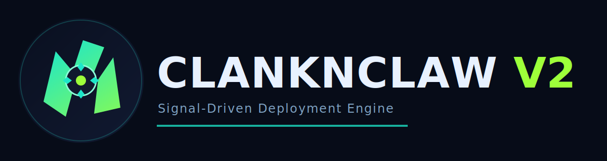
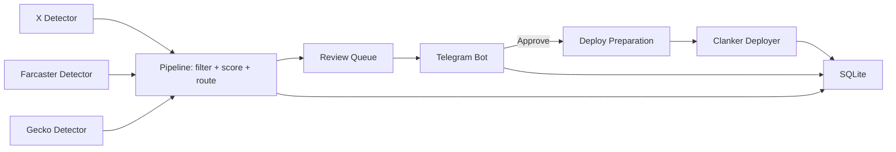

<p align="center">
  
</p>

<p align="center">
  <strong>Signal-Driven Token Deployment Engine for Base</strong><br/>
  Human-approved execution, deterministic routing, and production-grade operational guardrails.
</p>

<p align="center">
  
  
  
  
</p>

---

## Overview

`ClanknClaw v2` monitors high-signal deploy intent across social and market feeds, routes candidates through deterministic scoring, requires operator approval over Telegram, and executes deployment through Clanker.

The system is designed for always-on operation: bounded concurrency, timeout-driven workers, idempotent execution checks, and auditable lifecycle persistence.

## Brand identity

<table>
<tr>
<td align="center" width="50%">
<br/>
<sub><strong>Logo mark</strong> (avatar/fav/icon)</sub>
</td>
<td align="left" width="50%">
<strong>Design direction</strong><br/>
- 70% claw silhouette, 30% mechanical core.<br/>
- Palette: <code>midnight</code> + <code>teal/lime</code> accent.<br/>
- Represents fast predatory signal capture with engineered execution safety.
</td>
</tr>
</table>

## Core capabilities

| Area | Capability |
|---|---|
| Ingestion | X, Farcaster (Neynar), GeckoTerminal multi-network polling |
| Stealth transport | Rotating browser-like UA/header profiles + bounded jitter |
| Decisioning | Filter, scorer, router, and locked review queue |
| Execution | Clanker deploy adapter via Node bridge (`scripts/clanker_deploy.mjs`) |
| Operator plane | Telegram review cards + runtime control commands |
| Persistence | SQLite lifecycle tracking + retention cleanup + runtime settings |
| Reliability | Loop/candidate/deploy timeouts, bounded queues, retry-on-lock |
| Safety | Idempotent deploy flow, cross-source symbol dedup, SSRF-safe image fetch |

## Architecture



## Safety guardrails

- Candidate idempotency: skip deploy if candidate already has `deploy_success`.
- Cross-source symbol dedup: reject same `suggested_symbol` within rolling 24 hours.
- Idempotent review insert (`INSERT OR IGNORE`) for callback race safety.
- Gecko stale state eviction to prevent unbounded memory growth.
- Explicit deploy timeout controls:
  - `app.deploy_prepare_timeout_seconds`
  - `app.deploy_execute_timeout_seconds`

## Quick start

```bash
python3.11 -m venv venv
source venv/bin/activate
pip install -r requirements.txt
npm install

cp .env.example .env
# fill required envs

python -m clankandclaw.main
```

Detailed onboarding: [QUICKSTART.md](QUICKSTART.md)
Production runbook: [DEPLOYMENT.md](DEPLOYMENT.md)

## Configuration essentials

Main config: `config.yaml`

- `app`: runtime limits, timeouts, retention cleanup
- `x_detector`, `farcaster_detector`, `gecko_detector`: source polling and thresholds
- `deployment`: deployer + tax/reward behavior
- `stealth`: anti-block transport behavior
- `telegram`: thread routing and bot configuration

Required environment variables:

- `DEPLOYER_SIGNER_PRIVATE_KEY`
- `TOKEN_ADMIN_ADDRESS`
- `FEE_RECIPIENT_ADDRESS`
- `TELEGRAM_BOT_TOKEN`
- `TELEGRAM_CHAT_ID`
- `PINATA_JWT`
- `BASE_RPC_URL` or `ALCHEMY_BASE_RPC_URL`

Optional stealth overrides:

- `STEALTH_ENABLED`
- `STEALTH_ROTATE_EVERY`
- `STEALTH_JITTER_SIGMA_PCT`
- `STEALTH_JITTER_MIN_MS`
- `STEALTH_JITTER_MAX_MS`

Optional Telegram thread overrides (explicit static routing):

- `TELEGRAM_THREAD_REVIEW_ID`
- `TELEGRAM_THREAD_DEPLOY_ID`
- `TELEGRAM_THREAD_CLAIM_ID`
- `TELEGRAM_THREAD_OPS_ID`
- `TELEGRAM_THREAD_ALERT_ID`

## Telegram operations

Pairing and forum thread provisioning:

- `/pair` binds authorized chat to the current chat (persisted in `runtime_settings` as `telegram.chat_id`)
- In forum supergroups, `/pair` attempts to auto-create and bind topics:
  - `cnc-review`, `cnc-deploy`, `cnc-claim`, `cnc-ops`, `cnc-alert`
- `/autothread` retries topic provisioning and binding when permissions were fixed later
- On service startup, bot auto-attempts provisioning again for paired forum chats
- Required Telegram permission for auto-create: bot admin with `Manage Topics`

Runtime controls:

- `/control`
- `/setmode <review|auto>`
- `/setbot <on|off>`
- `/setdeployer <clanker|bankr|both>`

Wallet controls:

- `/wallets`
- `/setsigner <address|private_key|default>`
- `/setadmin <address|default>`
- `/setreward <address|default>`

Manual deploy commands:

- `/manualdeploy`
- `/deploynow <platform> <name> <symbol> <image_or_cid|auto> [description]`
- `/deployca <platform> <candidate_id>`

## Verification and ops

```bash
pytest -q

# deployment safety checks
sudo journalctl -u clankandclaw | grep -i "already has a successful deployment"
sudo journalctl -u clankandclaw | grep -i "token_dedup"
```

## Repository standards

- Contribution guide: [CONTRIBUTING.md](CONTRIBUTING.md)
- Security policy: [SECURITY.md](SECURITY.md)
- Code of conduct: [CODE_OF_CONDUCT.md](CODE_OF_CONDUCT.md)
- Changelog: [CHANGELOG.md](CHANGELOG.md)

## Scope limits

- Current production execution path: `clanker`.
- `bankr`/`both` deploy modes are persisted as runtime config but not yet active for execution.
- Default data plane remains SQLite for MVP operations.

## License

Proprietary. All rights reserved. See [LICENSE](LICENSE).

## Creator

Built by **Timcuan**.

- X: [@timcuan_id](https://x.com/timcuan_id)

## Support the author

If this project helps you, you can support ongoing development:

- Buy Me a Coffee: [buymeacoffee.com/timcuan_id](https://www.buymeacoffee.com/timcuan_id)
- Share and credit on X: [@timcuan_id](https://x.com/timcuan_id)
- Contribute code/docs via pull request (see [CONTRIBUTING.md](CONTRIBUTING.md))
