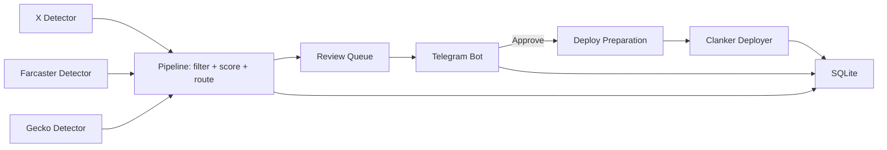

# Clank&Claw MVP

Signal-driven token deployment service for Base with operator approval, deterministic routing, and production guardrails.

## Why this exists

Clank&Claw is built for teams that need a controlled deployment pipeline, not a one-off bot script:

- Multiple signal sources (X, Farcaster, GeckoTerminal) with normalized ingestion.
- Deterministic filtering/scoring before anything reaches execution.
- Human-in-the-loop Telegram approval with runtime operational controls.
- Safe deploy path with idempotency and dedup guardrails.

## Core capabilities

| Area | Capability |
|---|---|
| Ingestion | X, Farcaster (Neynar), GeckoTerminal multi-network polling |
| Anti-block transport | Stealth HTTP layer (UA/header profile rotation + bounded jitter) |
| Decisioning | Quick filter, score engine, route selection, review queue locking |
| Execution | Clanker deploy adapter via Node bridge (`scripts/clanker_deploy.mjs`) |
| Operator UX | Telegram review cards, approval actions, ops/runtime commands |
| Persistence | SQLite lifecycle tracking + retention cleanup + runtime settings |
| Reliability | Worker loop timeout, candidate timeout, bounded queues, retry-on-lock |
| Safety | Candidate idempotency, symbol dedup window, SSRF-safe image fetching |

## Architecture



## Safety and reliability guardrails

- Candidate idempotency: deploy worker skips when same `candidate_id` already has `deploy_success`.
- Cross-source symbol dedup (24h): deploy preparation aborts on already-deployed `suggested_symbol`.
- Idempotent review insert: `INSERT OR IGNORE` for `review_items`.
- Gecko pool-state eviction prevents unbounded cooldown-map growth.
- Deploy path timeout controls:
  - `app.deploy_prepare_timeout_seconds`
  - `app.deploy_execute_timeout_seconds`

## Enterprise readiness checklist

- Deterministic decisioning before execution.
- Human approval gate and auditable lifecycle records.
- Runtime control plane via Telegram commands.
- Anti-block transport strategy for upstream API stability.
- Operational runbook (`DEPLOYMENT.md`) for service lifecycle, observability, and incident checks.

## Requirements

- Python `3.11+`
- Node.js + npm (for `clanker-sdk` bridge)
- SQLite 3
- Telegram bot token and chat ID
- Pinata JWT
- Base RPC endpoint
- Funded deployer signer wallet

## Quick start

```bash
# 1) install
python3.11 -m venv venv
source venv/bin/activate
pip install -r requirements.txt
npm install

# 2) configure
cp .env.example .env
# fill required env vars in .env

# 3) run
python -m clankandclaw.main
```

For a step-by-step operator flow, use [QUICKSTART.md](QUICKSTART.md).
For production setup, use [DEPLOYMENT.md](DEPLOYMENT.md).

## Configuration

Main config is in `config.yaml`.

### Important sections

- `app`: runtime limits, timeouts, retention cleanup.
- `x_detector`, `farcaster_detector`, `gecko_detector`: source-specific polling and thresholds.
- `deployment`: deployer and tax settings.
- `stealth`: anti-detection transport behavior.
- `telegram`: topic/thread routing and bot integration.

### Required environment variables

| Variable | Purpose |
|---|---|
| `DEPLOYER_SIGNER_PRIVATE_KEY` | signer private key for deploy tx |
| `TOKEN_ADMIN_ADDRESS` | token admin role address |
| `FEE_RECIPIENT_ADDRESS` | reward/fee recipient address |
| `TELEGRAM_BOT_TOKEN` | bot credential |
| `TELEGRAM_CHAT_ID` | target chat/group id |
| `PINATA_JWT` | IPFS upload auth |
| `BASE_RPC_URL` | Base RPC endpoint |

### Optional stealth overrides

- `STEALTH_ENABLED`
- `STEALTH_ROTATE_EVERY`
- `STEALTH_JITTER_SIGMA_PCT`
- `STEALTH_JITTER_MIN_MS`
- `STEALTH_JITTER_MAX_MS`

## Telegram operations

### Runtime controls

- `/control` shows live runtime state
- `/setmode <review|auto>`
- `/setbot <on|off>`
- `/setdeployer <clanker|bankr|both>`

Note: execution support is currently `clanker` only; `bankr` and `both` are stored but fail safely.

### Wallet controls

- `/wallets`
- `/setsigner <address|private_key|default>`
- `/setadmin <address|default>`
- `/setreward <address|default>`

### Manual deploy commands

- `/manualdeploy`
- `/deploynow <platform> <name> <symbol> <image_or_cid|auto> [description]`
- `/deployca <platform> <candidate_id>`

## Operations runbook

### Start service

```bash
python -m clankandclaw.main
```

### Critical verifications

```bash
# full test suite
pytest -q

# check duplicates/idempotency behavior in logs
sudo journalctl -u clankandclaw | grep -i "already has a successful deployment"
sudo journalctl -u clankandclaw | grep -i "token_dedup"
```

### Useful docs

- Production deployment: [DEPLOYMENT.md](DEPLOYMENT.md)
- Fast setup: [QUICKSTART.md](QUICKSTART.md)
- Clanker adapter details: [docs/CLANKER_INTEGRATION.md](docs/CLANKER_INTEGRATION.md)
- Change history: [CHANGELOG.md](CHANGELOG.md)

## Project layout

```text
clankandclaw/
  core/            # pipeline, workers, routing, deploy preparation
  deployers/       # deployer contracts and clanker adapter
  database/        # sqlite manager and queries
  telegram/        # bot rendering and actions
  utils/           # extraction, IPFS, stealth client, parsers
  models/          # pydantic domain models
```

## Security posture

- SSRF-safe image fetch flow with private/local address blocking.
- Strict data validation with Pydantic and structured parsing.
- Parameterized SQL and foreign keys for persistence integrity.
- Secrets isolated in `.env` and runtime environment.

## Current scope and limits

- Production-ready path: `clanker` deploy execution.
- `bankr`/`both` mode is reserved for future deployer rollout.
- SQLite is default system of record for MVP operations.

## Repository standards

- Contribution guide: [CONTRIBUTING.md](CONTRIBUTING.md)
- Security policy: [SECURITY.md](SECURITY.md)
- Code of conduct: [CODE_OF_CONDUCT.md](CODE_OF_CONDUCT.md)

## License

Proprietary. All rights reserved. See [LICENSE](LICENSE).
